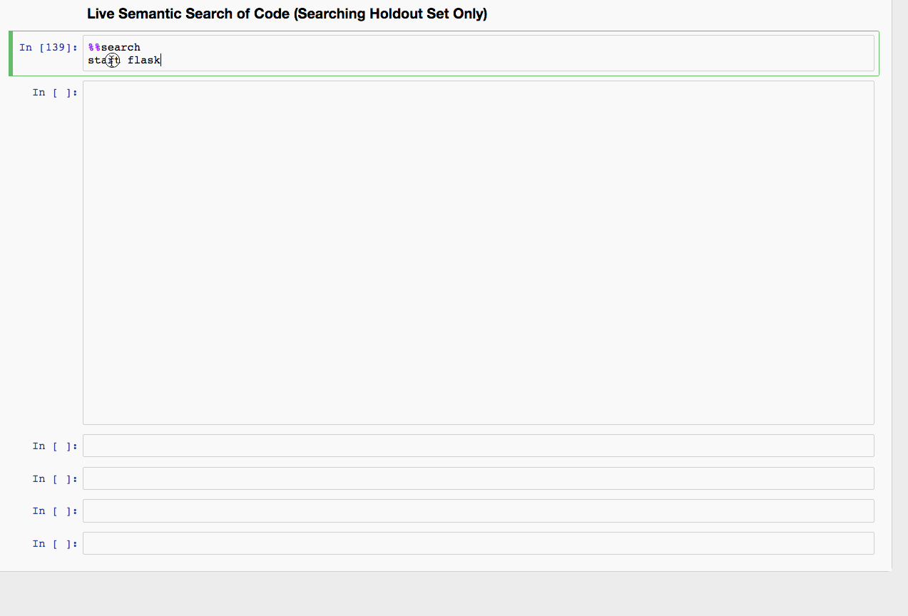

## Semantic Code Search

Code For Medium Article: "[How To Create A Natural Language Semantic Search Engine for Arbitrary Objects With Deep Learning]()"

---
## Resources

#### Docker Containers

You can use these container to reproduce the environment the authors used for this tutorial.

 - [hamelsmu/ml-gpu](https://hub.docker.com/r/hamelsmu/ml-gpu/): Use this container for any *gpu* bound parts of the tutorial.  We recommend running the entire tutorial on an aws `p3.8xlarge` and using this image.

 - [hamelsmu/ml-cpu](https://hub.docker.com/r/hamelsmu/ml-cpu/) Use this container for any *cpu* bound parts of this tutorial.

---
## PRs And Comments Are Welcome

We have made best attempts to make sure running this tutorial is as painless as possible.  If you think something can be improved, please submit a PR!   
