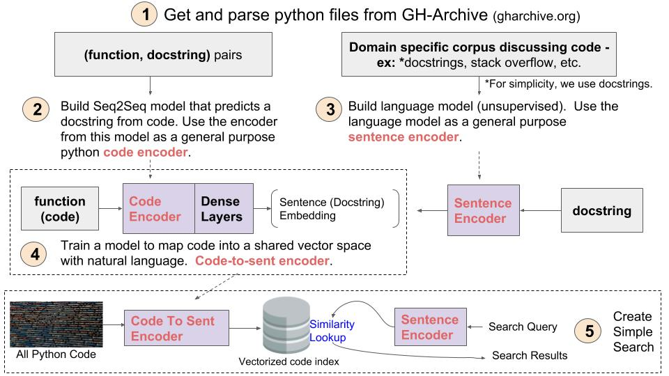

## Table of Contents

###Each step in the below diagram corresponds to a Jupyter notebook in this repo. Additionally, below is a high level description of each step:

[1 - Preprocess Data](./1\ -\ Preprocess\ Data.ipynb): describes how to get python files from gh-archive.org, and use the AST module to clean code and extract docstrings.

[2 - Train Function Summarizer](./2\ -\ Train\ Function\ Summarizer\ With\ Keras\ +\ TF.ipynb): build a sequence to sequence model to predict a docstring given a python function or method. The primary purpose of this model is for a transfer learning task that requires the extraction of features from code.

[3 - Train Language Model Using FastAI.ipynb](./3\ -\ Train\ Language\ Model\ Using\ FastAI.ipynb): Build a language model using [Fastai](https://github.com/fastai/fastai) on a corpus of docstrings. We will use this model for transfer learning to encode short phrases or sentences, such as docstrings and search queries.

[4 - TBD]() Fine-tune the model from step 2 to predict vectors instead of docstrings. These vectors will be produced by feeding docstrings through the language model produced in step 3. 

[5 - TBD]() Use the assets you created to created in steps 3 and 4 to create a semantic search engine.

